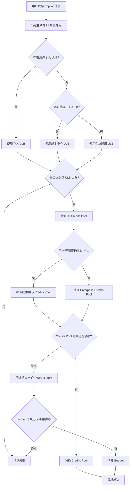
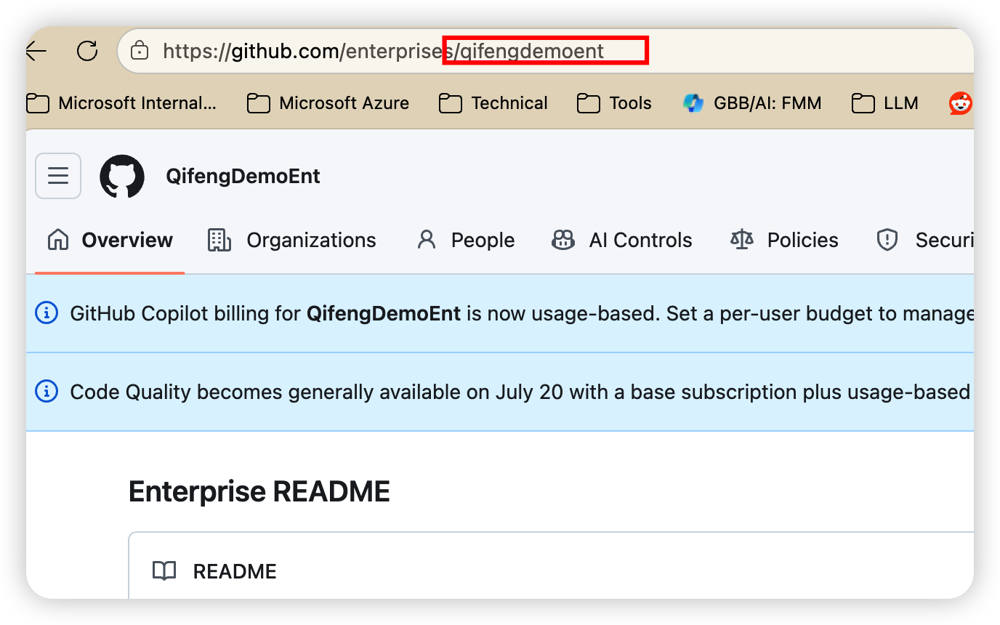
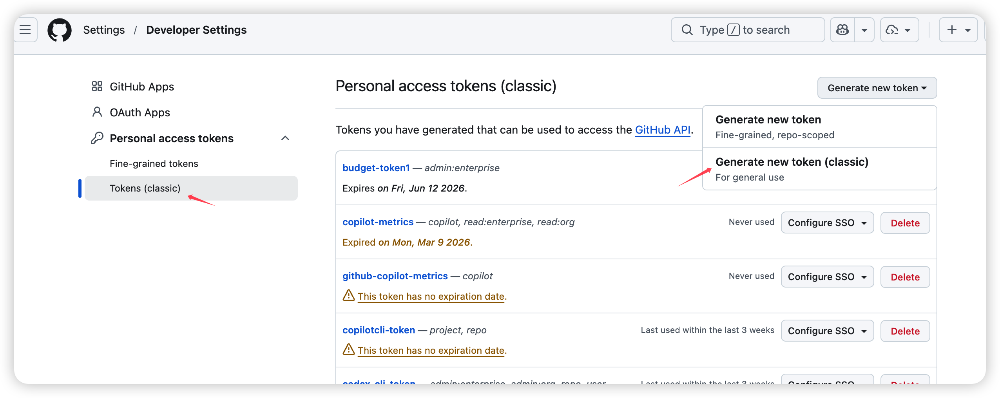
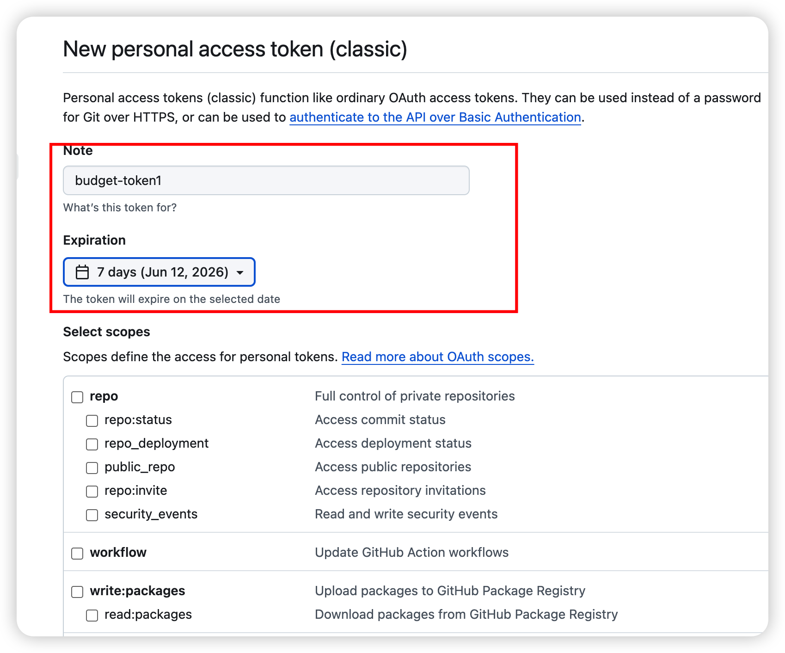
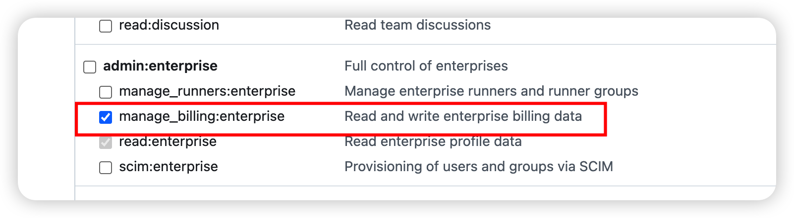
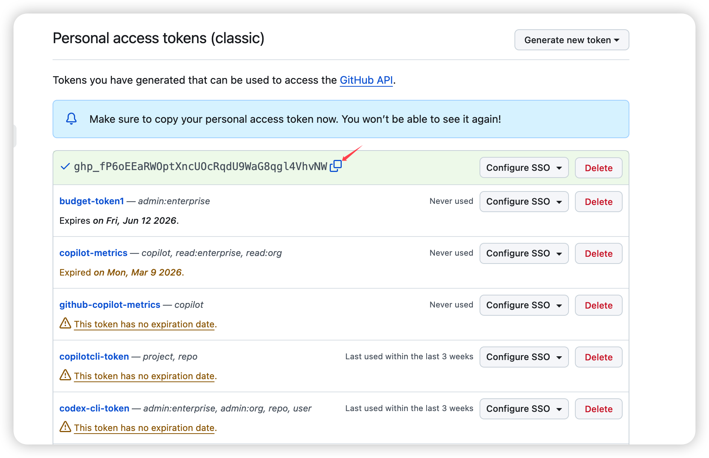

# GitHub Budget Management



上图描述了一次 Copilot 请求从发起到计费的完整判定流程：

1. **用户发起 Copilot 请求**：任意一次 Copilot 调用都会触发下面的额度与计费判定。
2. **确定生效的 User-Level Budget（ULB）**：按优先级从高到低选取一个生效的 ULB —— **用户个人 ULB > 成本中心 ULB > 企业通用 ULB**，命中即停，只有最高优先级的那个 ULB 生效。
3. **检查 ULB 是否超限**：如果已达到该 ULB 上限，则**请求直接失败**；否则进入 AI Credits Pool 检查。
4. **确定 AI Credits Pool 来源**：如果用户属于某个成本中心，检查**该成本中心的 Credits Pool**；否则检查**企业级 Enterprise Credits Pool**。
5. **优先消耗 Credits Pool**：如果对应 Credits Pool 仍有余额，则**优先扣减 Credits Pool**，请求成功。
6. **回退到 Budget**：如果 Credits Pool 已耗尽，则回退检查当前生效的 Budget —— 有可用额度则**扣减 Budget** 并成功；**若 Budget 也已用完，则请求失败**。

简单来说：**ULB 决定“能不能用”，Credits Pool 与 Budget 决定“从哪扣费”**—— 优先消耗 Credits Pool，用完再走 Budget，两者都没有额度时请求失败。

为 GitHub Enterprise 提供批量预算与成本中心配置能力：

| 功能 | 脚本 | 章节 |
|------|------|------|
| 批量为用户设置个人级别 Budget（含用量统计） | `set_user_budget.py` | [2](#2-批量为用户设置个人级别-budget) |
| 为成本中心启用单独的 AI Credit Pool | `enable_ai_credit_pool.py` | [3](#3-为成本中心启用单独的-ai-credit-pool) |
| 为成本中心设置统一的 User-Level Budget | `set_cost_center_budgets.py` | [4](#4-为成本中心设置统一的-user-level-budget) |

所有脚本的企业名称与 Token 均从 `settings.ini` 读取，配置一次即可（见[第 1 章](#1-获取企业名称和生成-token)）。

---

## 1. 获取企业名称和生成 Token

### 1.1 企业名称如何获取

- 企业名称可以在 GitHub Enterprise 账户设置中找到，通常是企业 URL 的一部分



### 1.2 生成 PAT Token

- 使用 `manage_billing:enterprise` scope 的 classic PAT

1. 登录 GitHub，点击右上角头像 → **Settings**

2. 左侧菜单滚动到底部，点击 **Developer settings**
3. 点击 **Personal access tokens** → **Tokens (classic)**
4. 点击 **Generate new token** → **Generate new token (classic)**

5. 填写信息：
   - **Note**: 填写用途描述，如 `Budget Management`
   - **Expiration**: 选择过期时间
   - **Scopes**: 勾选 `manage_billing:enterprise`


**截图中的 Token 已失效，仅用于演示**
6. 点击 **Generate token**
7. 复制生成的 token（以 `ghp_` 开头），妥善保存，关闭页面之后无法再次查看。


### 1.3 配置企业名称和 Token（推荐）

复制示例配置并填入你的企业名称与 Token，避免每次都在命令行传递：

```bash
cp settings.ini.example settings.ini
```

编辑 `settings.ini`：

```ini
[github]
enterprise = YOUR_ENTERPRISE
token = ghp_xxx
```

配置后即可省略 `--enterprise` 与 `--token`：

```bash
python set_user_budget.py --list
python enable_ai_credit_pool.py --list
```

> 取值优先级：命令行参数 > 环境变量（`GITHUB_ENTERPRISE` / `GITHUB_TOKEN`）> `settings.ini`。
> `settings.ini` 已加入 `.gitignore`，不会被提交，请勿将真实 Token 写入示例文件。

### 1.4 安全建议

- 不要将 token 提交到代码仓库
- 建议通过环境变量传递 token：
  ```bash
  export GITHUB_TOKEN=ghp_xxx
  python set_user_budget.py
  ```
- 定期轮换 token，设置合理的过期时间
- 遵循最小权限原则，仅授予必要的 scope

---

## 2. 批量为用户设置个人级别 Budget

脚本：`set_user_budget.py`，为企业用户批量设置个人级别 User-Level Budget。

### 2.1 配置 CSV 文件

编辑 `config.csv`，每行一个用户及其预算金额（USD/月）：

```csv
# GitHub Username, Monthly Budget (USD)
octocat,100
developer1,200
developer2,150
team-lead,500
intern1,50
```

### 2.2 预览（Dry Run）

```bash
python set_user_budget.py --dry-run
```

### 2.3 执行

```bash
python set_user_budget.py --config config.csv
```

### 2.4 列出所有用户预算

```bash
python set_user_budget.py --list
```

### 2.5 统计每个用户预算的已使用量

按用户逐个查询本月已消耗金额（`consumed_amount`），输出预算、已用、剩余与使用率：

```bash
python set_user_budget.py --usage
```

示例输出（数值为示意）：

```text
  Username                           Budget         Used    Remaining    Used%
  ------------------------------ ---------- ------------ ------------ --------
  developer1                     $      200 $      45.30 $     154.70    22.7%
  octocat                        $      100 $      98.10 $       1.90    98.1%
  ------------------------------ ---------- ------------ ------------ --------
  Total                          $      300 $     143.40 $     156.60    47.8%
  Users                                   2
```

> 已使用量来自 budgets 端点在传入 `?scope=user&user={login}` 时返回的顶层 `effective_budget.consumed_amount`（本月至今，单位 USD）。该接口每个用户需单独请求一次，脚本已内置每次请求间隔 1 秒的限流。

### 2.6 参数

| 参数 | 说明 |
|------|------|
| `--enterprise` | GitHub Enterprise 名称（未配置 `settings.ini` 时必填） |
| `--org` | GitHub Organization 名称（与 `--enterprise` 互斥） |
| `--token` | GitHub PAT（需要相应的 billing 权限） |
| `--config` | CSV 配置文件路径（默认 `config.csv`） |
| `--list` | 列出所有现有用户预算 |
| `--usage` | 统计每个用户预算的已使用量（预算/已用/剩余/使用率） |
| `--dry-run` | 仅预览，不实际执行 |

### 2.7 API 说明

使用 GitHub REST API (版本 `2026-03-10`)：

#### API 端点

- `GET /enterprises/{enterprise}/settings/billing/budgets` - 列出现有预算
- `GET /enterprises/{enterprise}/settings/billing/budgets?scope=user&user={login}` - 查询单个用户已使用量（返回 `effective_budget.consumed_amount`）
- `POST /enterprises/{enterprise}/settings/billing/budgets` - 创建预算
- `PATCH /enterprises/{enterprise}/settings/billing/budgets/{budget_id}` - 更新预算

#### 脚本逻辑

1. 获取所有现有 user scope 预算（自动分页）
2. 对每个用户，检查是否已有预算
3. 如已存在且金额相同，跳过
4. 如已存在但金额不同，更新
5. 如不存在，创建新预算

#### 创建 Budget 时传递的参数（POST）

```json
{
  "budget_amount": 150,
  "prevent_further_usage": true,
  "budget_scope": "user",
  "budget_entity_name": "username",
  "budget_product_sku": "ai_credits",
  "budget_type": "BundlePricing",
  "budget_alerting": {
    "will_alert": true,
    "alert_recipients": ["username"]
  },
  "user": "username"
}
```

| 字段 | 值 | 说明 |
|------|------|------|
| `budget_amount` | 动态 | 从 config.csv 读取的金额 |
| `prevent_further_usage` | `true` | User scope 强制要求 |
| `budget_scope` | `"user"` | 用户级别预算 |
| `budget_entity_name` | 用户名 | 目标用户的 GitHub login |
| `budget_product_sku` | `"ai_credits"` | AI Credits 产品 |
| `budget_type` | `"BundlePricing"` | Bundle 定价类型 |
| `budget_alerting.will_alert` | `true` | 启用告警 |
| `budget_alerting.alert_recipients` | `[用户名]` | 告警接收人 |
| `user` | 用户名 | 目标用户 |

#### 更新 Budget 时传递的参数（PATCH）

```json
{
  "budget_amount": 150,
  "prevent_further_usage": true
}
```

| 字段 | 值 | 说明 |
|------|------|------|
| `budget_amount` | 动态 | 从 config.csv 读取的新金额 |
| `prevent_further_usage` | `true` | User scope 强制要求 |

> **注意**: 更新时不可传递 `budget_scope`、`budget_entity_name` 等字段，这些字段创建后不可变。

#### 注意事项

- User scope 预算的 `prevent_further_usage` 必须为 `true`（API 强制要求）
- API 每页返回最多 10 条预算，脚本自动处理分页

---

## 3. 为成本中心启用单独的 AI Credit Pool

脚本：`enable_ai_credit_pool.py`，根据 **Cost Center 名称** 批量启用（或关闭）AI Credit Pool。启用后，该 Cost Center 仅可使用由归属到它的 License 所提供的 AI Credits。额度由系统自动计算：

- Copilot Business：每个 License 每月 1,900 AI Credits
- Copilot Enterprise：每个 License 每月 3,900 AI Credits

> 该控制项没有自定义额度，只能开启或关闭。

### 3.1 列出所有 Cost Center 及 AI Pool 状态

```bash
python enable_ai_credit_pool.py --list
```

建议先执行 `--list`，确认 Cost Center 名称与当前状态。输出除 AI Pool 开关外，还包含 AI Credit Pool 的 `Target`（目标额度 `target_amount`）与 `Current`（当前额度 `current_amount`）：

```text
  Name                                  AI Pool          Target        Current  Cost Center ID
  ------------------------------------ -------- -------------- -------------- ------------------------
  External                             ON               100.00           0.00  4c7c5f46-d72a-4b10-8295-0de6029353a2
```

如需查看接口返回的完整原始 JSON（不做任何过滤，包含所有字段与状态），使用 `--raw`：

```bash
python enable_ai_credit_pool.py --raw
```

### 3.2 按名称启用

```bash
# 启用一个或多个（--name 可重复）
python enable_ai_credit_pool.py \
    --name "Cost Center A" --name "Cost Center B"
```

### 3.3 从 CSV 批量启用

编辑 `cost_centers.csv`，每行一个 Cost Center 名称：

```csv
# Cost Center Name (one per line)
Cost Center A
Cost Center B
```

```bash
python enable_ai_credit_pool.py --config cost_centers.csv
```

### 3.4 预览（Dry Run）

```bash
python enable_ai_credit_pool.py \
    --name "Cost Center A" --dry-run
```

### 3.5 关闭 AI Credit Pool

```bash
python enable_ai_credit_pool.py \
    --name "Cost Center A" --disable
```

### 3.6 参数

| 参数 | 说明 |
|------|------|
| `--enterprise` | GitHub Enterprise 名称（未配置 `settings.ini` 时必填） |
| `--token` | GitHub PAT（需要 `manage_billing:enterprise` 权限） |
| `--name` | Cost Center 名称，可重复指定多个 |
| `--config` | CSV 文件路径，每行一个 Cost Center 名称 |
| `--list` | 列出所有 Cost Center 及 AI Pool 状态（含 Target / Current 额度） |
| `--raw` | 打印 Cost Center 接口返回的原始 JSON（用于排查字段） |
| `--disable` | 关闭而非启用 AI Credit Pool |
| `--dry-run` | 仅预览，不实际执行 |

### 3.7 API 说明

使用 GitHub REST API (版本 `2026-03-10`)：

#### API 端点

- `GET   /enterprises/{enterprise}/settings/billing/cost-centers` - 列出 Cost Center
- `PATCH /enterprises/{enterprise}/settings/billing/cost-centers/{cost_center_id}` - 启用/关闭 AI Credit Pool

#### 脚本逻辑

1. 获取所有 Cost Center（自动分页）
2. 按名称匹配（不区分大小写）找到对应的 `cost_center_id`
3. 如当前状态已符合，跳过；否则 PATCH 更新
4. 名称未找到则记录在 Not found 中

#### 启用时传递的参数（PATCH）

```json
{
  "name": "IT",
  "ai_credit_pool_enabled": true
}
```

| 字段 | 值 | 说明 |
|------|------|------|
| `name` | Cost Center 名称 | **必填**，该端点同时用于「更新成本中心名称」，缺失会返回 422 |
| `ai_credit_pool_enabled` | `true` / `false` | 是否启用该 Cost Center 的 AI Credit Pool |

#### 注意事项

- 该 PATCH 端点要求 `name` 字段为必填，脚本会自动使用 API 返回的真实名称
- list（GET）接口会返回 `ai_credit_pool_enabled` 及 `ai_credit_pool_state`（含 `target_amount` / `current_amount`），`--list` 会展示为 AI Pool、Target、Current 列
- 脚本兼容 list 接口返回 `costCenters` / `cost_centers` / 纯数组三种结构
- 名称匹配不区分大小写，并自动去重
- 只能操作 `state` 为 `active` 的 Cost Center

---

## 4. 为成本中心设置统一的 User-Level Budget

脚本：`set_cost_center_budgets.py`，按 **Cost Center 名称** 为成本中心内的**每个用户**设置统一的月度 AI Credits 预算（`budget_scope = multi_user_cost_center`）。脚本会自动把成本中心名称解析为 Cost Center ID 用于创建，并匹配已有预算决定创建或更新。

### 4.1 配置 CSV 文件

编辑 `cost_center_budgets.csv`，每行一个成本中心及其每用户预算金额（USD/月）：

```csv
# Cost Center Name, Monthly per-user Budget (USD)
IT,50
Marketing,100
```

### 4.2 列出已有成本中心预算

```bash
python set_cost_center_budgets.py --list
```

### 4.3 预览（Dry Run）

```bash
# 从 CSV
python set_cost_center_budgets.py --config cost_center_budgets.csv --dry-run

# 单个成本中心
python set_cost_center_budgets.py --name "IT" --amount 50 --dry-run
```

### 4.4 执行

```bash
# 从 CSV 批量
python set_cost_center_budgets.py --config cost_center_budgets.csv

# 单个成本中心
python set_cost_center_budgets.py --name "IT" --amount 50
```

### 4.5 参数

| 参数 | 说明 |
|------|------|
| `--enterprise` | GitHub Enterprise 名称（未配置 `settings.ini` 时必填） |
| `--token` | GitHub PAT（需要 `manage_billing:enterprise` 权限） |
| `--config` | CSV 文件路径（`成本中心名称,金额`） |
| `--name` | 单个成本中心名称（需配合 `--amount`） |
| `--amount` | 每用户每月预算金额（USD），用于 `--name` |
| `--create` | 强制使用 POST 创建（跳过更新逻辑） |
| `--list` | 列出已有成本中心预算 |
| `--dry-run` | 仅预览，不实际执行 |

### 4.6 API 说明

使用 GitHub REST API (版本 `2026-03-10`)：

#### API 端点

- `GET   /enterprises/{enterprise}/settings/billing/cost-centers` - 列出 Cost Center（解析名称→ID）
- `GET   /enterprises/{enterprise}/settings/billing/budgets` - 列出现有预算
- `POST  /enterprises/{enterprise}/settings/billing/budgets` - 创建成本中心预算
- `PATCH /enterprises/{enterprise}/settings/billing/budgets/{budget_id}` - 更新预算金额

#### 脚本逻辑

1. 获取所有 Cost Center，按名称（不区分大小写）解析出 `cost_center_id`
2. 获取所有现有预算，匹配 `budget_scope` 为 `multi_user_cost_center` / `cost_center` 且名称一致者
3. 如已存在且金额相同，跳过；金额不同则 PATCH 更新
4. 如不存在，POST 创建
5. 名称未找到则记录在 Not found 中

#### 创建 Budget 时传递的参数（POST）

```json
{
  "budget_amount": 50,
  "prevent_further_usage": true,
  "budget_scope": "multi_user_cost_center",
  "budget_entity_name": "COST_CENTER_ID",
  "budget_type": "BundlePricing",
  "budget_product_sku": "ai_credits",
  "budget_alerting": {
    "will_alert": false,
    "alert_recipients": []
  }
}
```

| 字段 | 值 | 说明 |
|------|------|------|
| `budget_amount` | 动态 | 每用户每月预算金额 |
| `prevent_further_usage` | `true` | per-user 预算强制要求 |
| `budget_scope` | `"multi_user_cost_center"` | 成本中心级别的 user-level 预算 |
| `budget_entity_name` | Cost Center ID | **创建时传 ID**，由名称解析得到 |
| `budget_type` | `"BundlePricing"` | Bundle 定价类型 |
| `budget_product_sku` | `"ai_credits"` | AI Credits 产品 |
| `budget_alerting` | 对象 | 告警配置，默认不告警 |

#### 注意事项

- **创建时** `budget_entity_name` 传 Cost Center ID；但 **列出时** API 返回的同一预算 `budget_scope` 为 `cost_center`、`budget_entity_name` 为成本中心**名称**，脚本已据此匹配
- 更新仅传 `budget_amount` 与 `prevent_further_usage`
- 该预算作用于成本中心内的**每个用户**，与第 2 章的单用户预算不同
