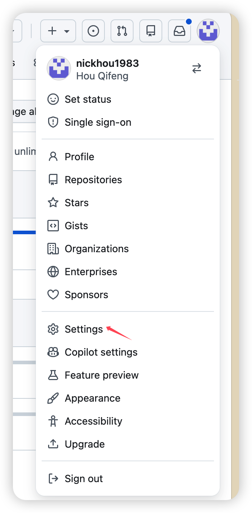

# GitHub Budget Management

批量为企业用户设置 User-Level Budget（差异化金额）。

## 使用方法

### 0. 配置企业名称和 Token（推荐）

复制示例配置并填入你的企业名称与 Token，避免每次都在命令行传递：

```bash
cp settings.ini.example settings.ini
```

编辑 `settings.ini`：

```ini
[github]
enterprise = YOUR_ENTERPRISE
token = ghp_xxx
```

配置后即可省略 `--enterprise` 与 `--token`：

```bash
python batch_set_budgets.py --list
python enable_ai_credit_pool.py --list
```

> 取值优先级：命令行参数 > 环境变量（`GITHUB_ENTERPRISE` / `GITHUB_TOKEN`）> `settings.ini`。
> `settings.ini` 已加入 `.gitignore`，不会被提交，请勿将真实 Token 写入示例文件。

### 1. 配置 CSV 文件

编辑 `config.csv`，每行一个用户及其预算金额（USD/月）：

```csv
# GitHub Username, Monthly Budget (USD)
octocat,100
developer1,200
developer2,150
team-lead,500
intern1,50
```

### 2. Enterprise 模式

#### 预览（Dry Run）

```bash
python batch_set_budgets.py --enterprise YOUR_ENTERPRISE --token ghp_xxx --dry-run
```

#### 执行

```bash
python batch_set_budgets.py --enterprise YOUR_ENTERPRISE --token ghp_xxx --config config.csv
```

### 3. 列出所有用户预算

```bash
python batch_set_budgets.py --enterprise YOUR_ENTERPRISE --token ghp_xxx --list
```

## 参数

| 参数 | 说明 |
|------|------|
| `--enterprise` | GitHub Enterprise 名称（必填） |
| `--token` | GitHub PAT（需要相应的 billing 权限） |
| `--config` | CSV 配置文件路径（默认 `config.csv`） |
| `--list` | 列出所有现有用户预算 |
| `--dry-run` | 仅预览，不实际执行 |

## 企业名称如何获取

- 企业名称可以在 GitHub Enterprise 账户设置中找到，通常是企业 URL 的一部分




## Token 如何获取

- 使用 `manage_billing:enterprise` scope 的 classic PAT

### 创建 GitHub PAT Token


1. 登录 GitHub，点击右上角头像 → **Settings**

2. 左侧菜单滚动到底部，点击 **Developer settings**

3. 点击 **Personal access tokens** → **Tokens (classic)**
4. 点击 **Generate new token** → **Generate new token (classic)**

5. 填写信息：
   - **Note**: 填写用途描述，如 `Budget Management`
   - **Expiration**: 选择过期时间
   - **Scopes**: 勾选 `manage_billing:enterprise`


**截图中的Token已失效，仅用于演示**
6. 点击 **Generate token**
7. 复制生成的 token（以 `ghp_` 开头），妥善保存，关闭页面之后无法再次查看。


### 安全建议

- 不要将 token 提交到代码仓库
- 建议通过环境变量传递 token：
  ```bash
  export GITHUB_TOKEN=ghp_xxx
  python batch_set_budgets.py --enterprise YOUR_ENTERPRISE --token $GITHUB_TOKEN
  ```
- 定期轮换 token，设置合理的过期时间
- 遵循最小权限原则，仅授予必要的 scope

## API 说明

使用 GitHub REST API (版本 `2026-03-10`)：

### API 端点
- `GET /enterprises/{enterprise}/settings/billing/budgets` - 列出现有预算
- `POST /enterprises/{enterprise}/settings/billing/budgets` - 创建预算
- `PATCH /enterprises/{enterprise}/settings/billing/budgets/{budget_id}` - 更新预算

### 脚本逻辑
1. 获取所有现有 user scope 预算（自动分页）
2. 对每个用户，检查是否已有预算
3. 如已存在且金额相同，跳过
4. 如已存在但金额不同，更新
5. 如不存在，创建新预算

### 创建 Budget 时传递的参数（POST）

```json
{
  "budget_amount": 150,
  "prevent_further_usage": true,
  "budget_scope": "user",
  "budget_entity_name": "username",
  "budget_product_sku": "ai_credits",
  "budget_type": "BundlePricing",
  "budget_alerting": {
    "will_alert": true,
    "alert_recipients": ["username"]
  },
  "user": "username"
}
```

| 字段 | 值 | 说明 |
|------|------|------|
| `budget_amount` | 动态 | 从 config.csv 读取的金额 |
| `prevent_further_usage` | `true` | User scope 强制要求 |
| `budget_scope` | `"user"` | 用户级别预算 |
| `budget_entity_name` | 用户名 | 目标用户的 GitHub login |
| `budget_product_sku` | `"ai_credits"` | AI Credits 产品 |
| `budget_type` | `"BundlePricing"` | Bundle 定价类型 |
| `budget_alerting.will_alert` | `true` | 启用告警 |
| `budget_alerting.alert_recipients` | `[用户名]` | 告警接收人 |
| `user` | 用户名 | 目标用户 |

### 更新 Budget 时传递的参数（PATCH）

```json
{
  "budget_amount": 150,
  "prevent_further_usage": true
}
```

| 字段 | 值 | 说明 |
|------|------|------|
| `budget_amount` | 动态 | 从 config.csv 读取的新金额 |
| `prevent_further_usage` | `true` | User scope 强制要求 |

> **注意**: 更新时不可传递 `budget_scope`、`budget_entity_name` 等字段，这些字段创建后不可变。

### 注意事项
- User scope 预算的 `prevent_further_usage` 必须为 `true`（API 强制要求）
- API 每页返回最多 10 条预算，脚本自动处理分页

---

## Cost Center AI Credit Pool

根据 **Cost Center 名称** 批量启用（或关闭）AI Credit Pool。启用后，该 Cost Center 仅可使用由归属到它的 License 所提供的 AI Credits。额度由系统自动计算：

- Copilot Business：每个 License 每月 3,000 AI Credits
- Copilot Enterprise：每个 License 每月 7,000 AI Credits

> 该控制项没有自定义额度，只能开启或关闭。

对应脚本：`enable_ai_credit_pool.py`

## 使用方法

### 1. 列出所有 Cost Center 及 AI Pool 状态

```bash
python enable_ai_credit_pool.py --enterprise YOUR_ENTERPRISE --token ghp_xxx --list
```

建议先执行 `--list`，确认 Cost Center 名称与当前状态。

### 2. 按名称启用

```bash
# 启用一个或多个（--name 可重复）
python enable_ai_credit_pool.py --enterprise YOUR_ENTERPRISE --token ghp_xxx \
    --name "Cost Center A" --name "Cost Center B"
```

### 3. 从 CSV 批量启用

编辑 `cost_centers.csv`，每行一个 Cost Center 名称：

```csv
# Cost Center Name (one per line)
Cost Center A
Cost Center B
```

```bash
python enable_ai_credit_pool.py --enterprise YOUR_ENTERPRISE --token ghp_xxx --config cost_centers.csv
```

### 4. 预览（Dry Run）

```bash
python enable_ai_credit_pool.py --enterprise YOUR_ENTERPRISE --token ghp_xxx \
    --name "Cost Center A" --dry-run
```

### 5. 关闭 AI Credit Pool

```bash
python enable_ai_credit_pool.py --enterprise YOUR_ENTERPRISE --token ghp_xxx \
    --name "Cost Center A" --disable
```

## 参数

| 参数 | 说明 |
|------|------|
| `--enterprise` | GitHub Enterprise 名称（必填） |
| `--token` | GitHub PAT（需要 `manage_billing:enterprise` 权限） |
| `--name` | Cost Center 名称，可重复指定多个 |
| `--config` | CSV 文件路径，每行一个 Cost Center 名称 |
| `--list` | 列出所有 Cost Center 及 AI Pool 状态 |
| `--disable` | 关闭而非启用 AI Credit Pool |
| `--dry-run` | 仅预览，不实际执行 |

## API 说明

使用 GitHub REST API (版本 `2026-03-10`)：

### API 端点
- `GET   /enterprises/{enterprise}/settings/billing/cost-centers` - 列出 Cost Center
- `PATCH /enterprises/{enterprise}/settings/billing/cost-centers/{cost_center_id}` - 启用/关闭 AI Credit Pool

### 脚本逻辑
1. 获取所有 Cost Center（自动分页）
2. 按名称匹配（不区分大小写）找到对应的 `cost_center_id`
3. 如当前状态已符合，跳过；否则 PATCH 更新
4. 名称未找到则记录在 Not found 中

### 启用时传递的参数（PATCH）

```json
{
  "ai_credit_pool_enabled": true
}
```

| 字段 | 值 | 说明 |
|------|------|------|
| `ai_credit_pool_enabled` | `true` / `false` | 是否启用该 Cost Center 的 AI Credit Pool |

### 注意事项
- 脚本兼容 list 接口返回 `costCenters` / `cost_centers` / 纯数组三种结构
- 名称匹配不区分大小写，并自动去重
